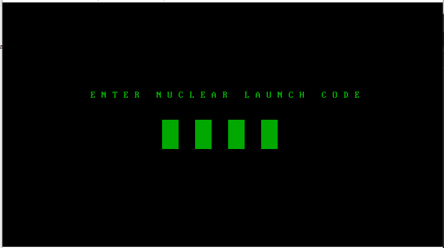

# Nuclear Warfare Writeup

## setup: 

-run the NuclearWarfare.iso in virtual machine

So we need to guess what's the 4 digits of the nuclear launch code to get the flag

## Tools used:

-Arduino Leonardo (to use the Keyboard.h library)

## Technique that I used:

-write a arduino script that used Keyboard.h library to brute force 0000-9999

-flash the code into my Arduino Leonardo & boot the image.

-click into the image & plug in the Arduino Leonardo 

-wait for it to brute force the correct nuclear launch code to capture the flag

PoC
===

